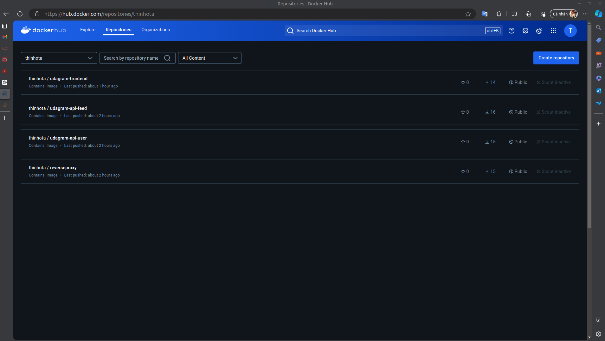
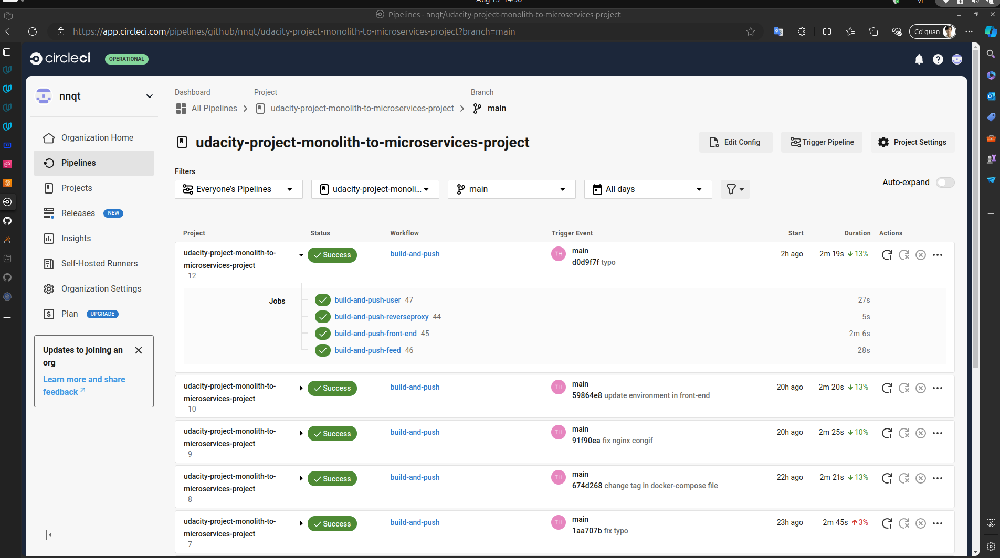
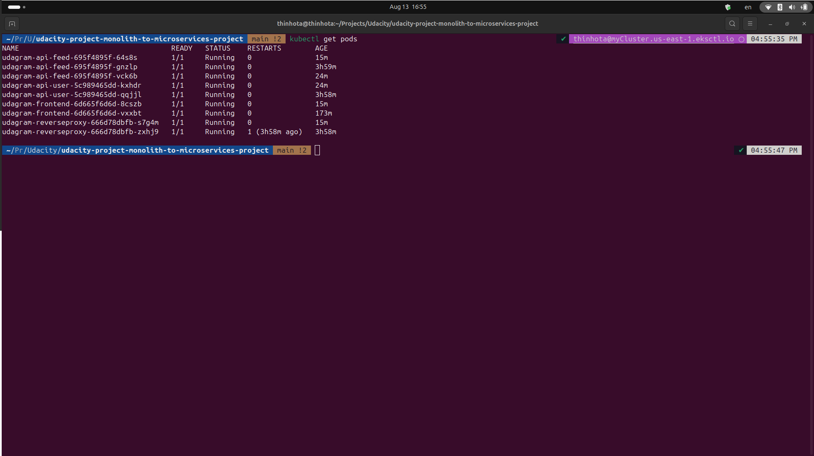
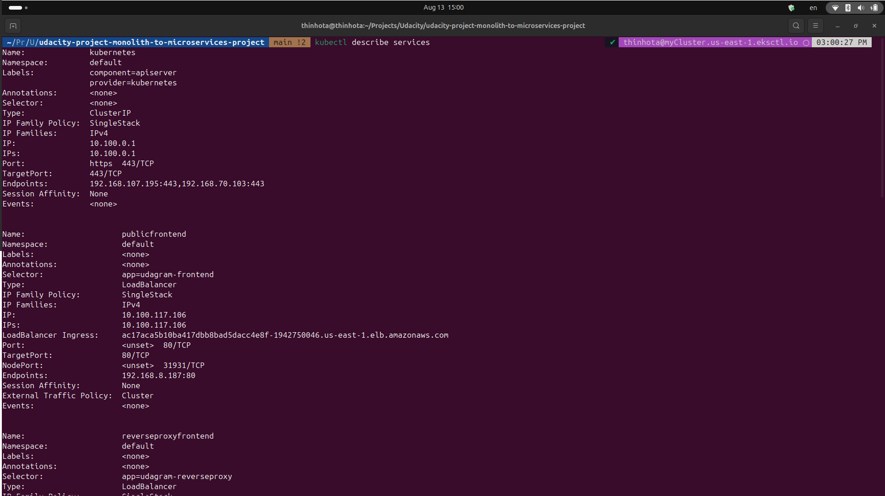
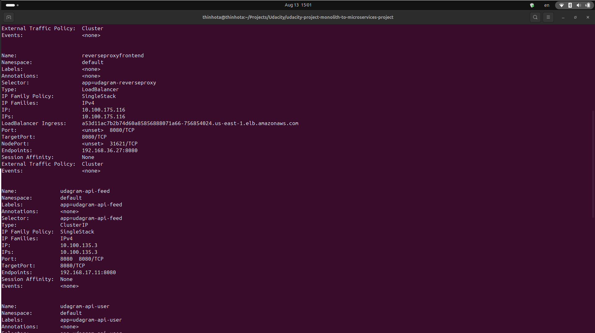
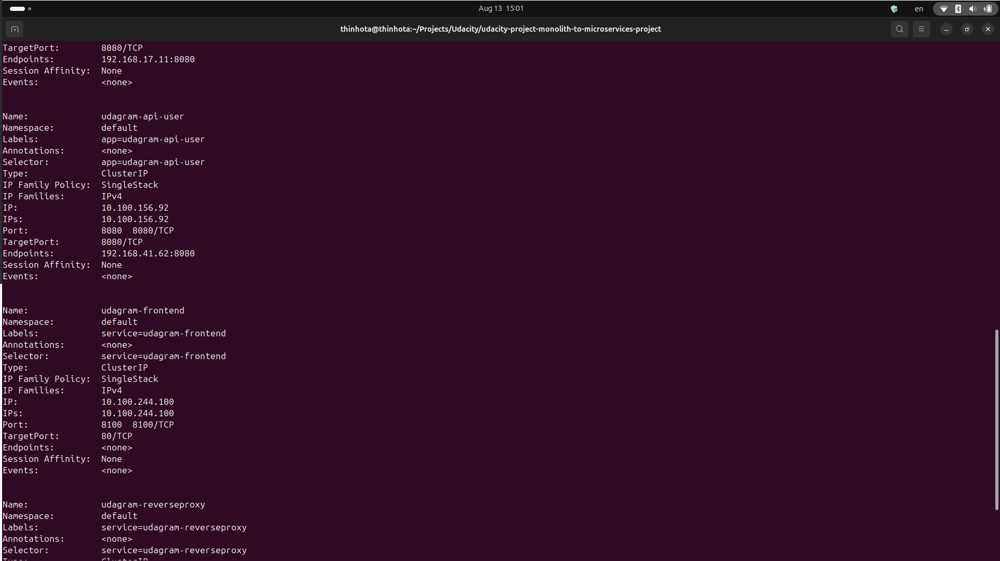
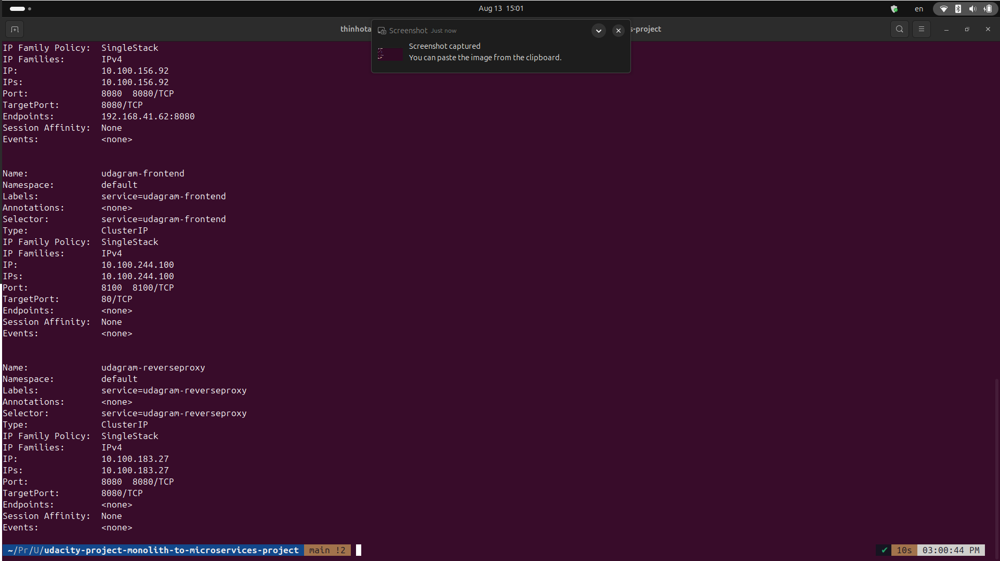
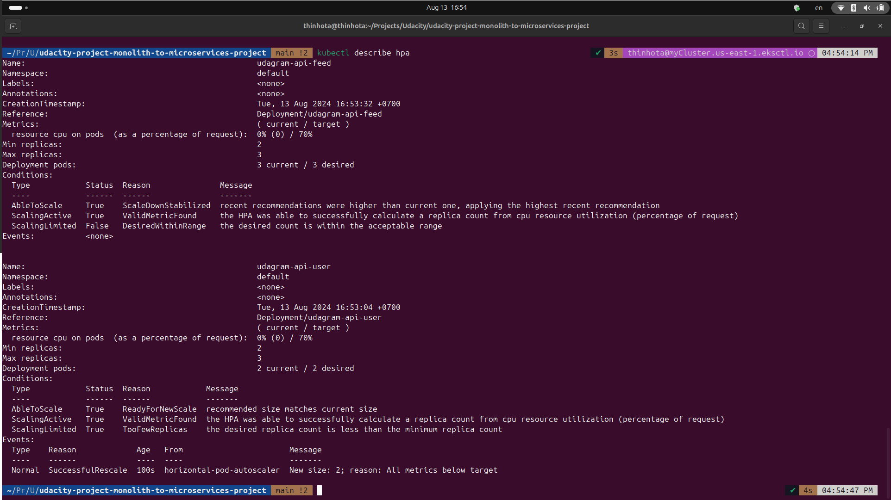

# Udagram Image Filtering Application

Udagram is a simple cloud application developed alongside the Udacity Cloud Developer Nanodegree. It allows users to register and log into a web client, post photos to the feed, and process photos using an image filtering microservice.

The project is split into two parts:

- **Frontend**: Angular web application built with Ionic Framework.
- **Backend RESTful API**: Node-Express application.

## Report

### Containers and Microservices

1. **Dividing an Application into Microservices**
    - The application is structured into microservices, as shown in the project directory.

2. **Building and Running a Container Image Using Docker**
    - The Docker image is available in my Docker Hub repository.

    

### Independent Releases and Deployments

1. **CI/CD Pipeline with CircleCI**
    - The project uses CircleCI for continuous integration and continuous deployment.
    - The configuration can be found in the `.circleci` directory.

    

### Service Orchestration with Kubernetes

1. **Deploying Microservices on AWS using Kubernetes**
    - The microservices are successfully deployed on a Kubernetes cluster.
    - The output of `kubectl get pods` indicates that the pods are running successfully with the `STATUS` value `Running`.

    

2. **Service Descriptions**
    - The output of `kubectl describe services` confirms that no sensitive information such as database passwords is exposed.

    
    
    
    
    
    
    

3. **Configuring Scaling and Self-Healing**
    - The Horizontal Pod Autoscaler (HPA) is configured, and its status is shown below.

    

### Debugging, Monitoring, and Logging

1. **Using Logs for Debugging**
    - The logs from the backend API pods capture user activity and API call events, which are crucial for debugging.

    
